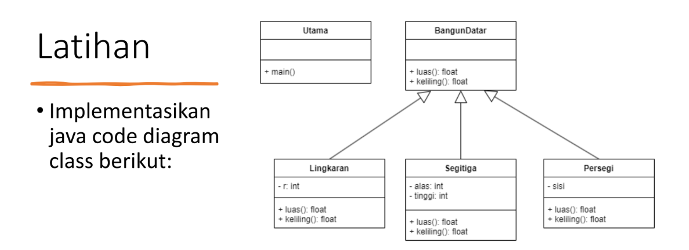
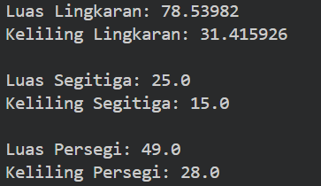

# OOP-Praktikum-5


## 1. Bangun Datar
```java
public class BangunDatar {

    // Metode untuk menghitung luas
    public float hitungLuas(float luas) {
        return luas;
    }

    // Metode untuk menghitung keliling
    public float hitungKeliling(float keliling) {
        return keliling;
    }
}
```

## 2. Lingkaran
```java
public class Lingkaran extends BangunDatar {
    private int r;

    // Constructor untuk menginisialisasi atribut r
    public Lingkaran(int r) {
        this.r = r;
    }

    // menghitung luas lingkaran menggunakan jari-jari
    public float luas() {
        return (float) (Math.PI * r * r);
    }

    // Keliling
    public float keliling() {
        return (float) (2 * Math.PI * r);
    }
}
```

## 3. Seigita
```java
public class Persegi extends BangunDatar {
    private float sisi;

    public Persegi (float sisi) {
        this.sisi = sisi;
    }

    public float luas() {
        return (float) (sisi * sisi);
    }

    public float keliling() {
        return (float) (4 * sisi);
    }
}
```

## 4. Persegi
```java
public class Persegi extends BangunDatar {
    private float sisi;

    public Persegi (float sisi) {
        this.sisi = sisi;
    }

    public float luas() {
        return (float) (sisi * sisi);
    }

    public float keliling() {
        return (float) (4 * sisi);
    }
}

```

## Output

